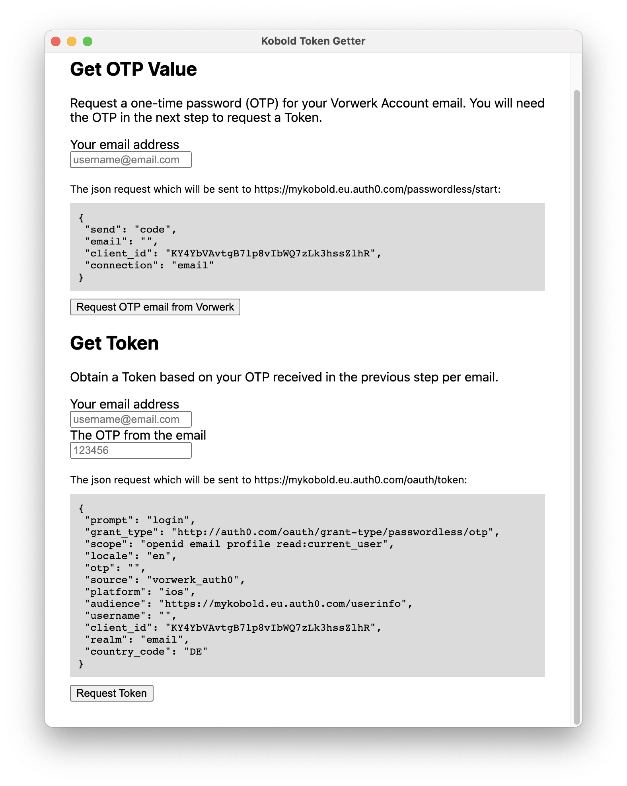

# Kobold Token Getter

Simple UI for retrieving a Kobold authentication token that can be used in conjuction with the Homebridge plugin [homebridge-kobold](https://github.com/himbeles/homebridge-kobold).

You can download compiled binaries attached to the [releases](https://github.com/himbeles/kobold-token-get/releases).

Elsewise, run 
```sh
npm install .
npm run package
```


